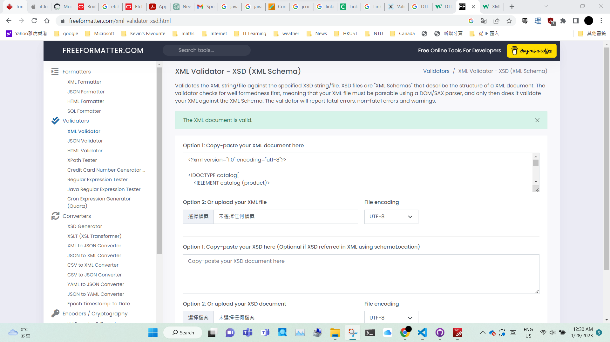

# Assignment

1. Open `module-3/assignments/assignment.xml` in your editor
2. Create DTD for this file and validate it using any of the tools we used
3. Create XSD for this file and validate it using any of the tools we used
4. Explain your thought process for these 2 declarations

Create `module-3/assignments/assignment_YOURNAME.md` and add your theory answers. Add screenshots of each step to the file.

2. Create DTD for this file and validate it using any of the tools we used
created assignment_module3_dtd
this XML file with DTD has been validated

3. Create XSD for this file and validate it using any of the tools we used
created assignment_module3_xsd
this XSD file has been validated

4. Explain your thought process for these 2 declarations
For me, I think creatring the 2 declarations are similar. Creating the 2 declarations require understanding the structure of the XML document. I decleared the variable of the top of the XML document structure then to bottom, from elements to attributes. I found that the structure of the XML document with dtd is more simplified than to XSD file, but XSD file is more clear than to XML document with dtd.