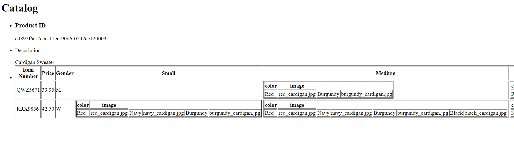
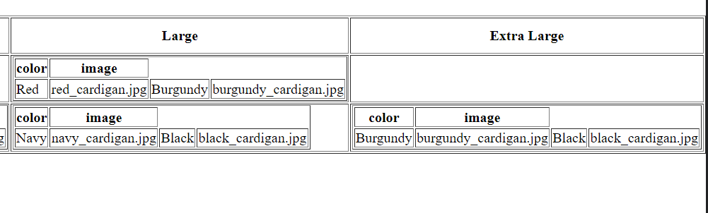

- main title is "Catalog"
I used <h1> for main title

- use html list tag to display catalog
I used html list to display productID, description and the table

- render each item as `<article>` inside list item tag
I used html list to display productID, description and the table

- display product id as h3
I used <h3> for displaying product id.

- display product description as paragraph
I used 
 for displaying product description.

- render table of catalog items with columns: item number, price, gender, small, medium, large, extra large (if column item is not present in item, then display empty cell)
I used a table with table headings <th> with columns item number, price, gender, small, medium, large, extra large. I used <xsl:for-each select = "catalog/product/catalog_item"> to display catalog items. For each sizes, I tried to create a table for each of them. I used <xsl:for-each> to create a table title, and use <xsl:for-each> in each for rendering all rows of color and image.

- for gender column render M for Men, W for Women
I used <xsl:choose> with <xsl:when test> to determine the Letter to render.

- inside size columns (small, medium, large, and extra large) display subtable with 2 columns: color and image
I used <xsl:for-each> to create a table title, and use <xsl:for-each> in each for rendering all rows of color and image for all size columns.

Screenshots

